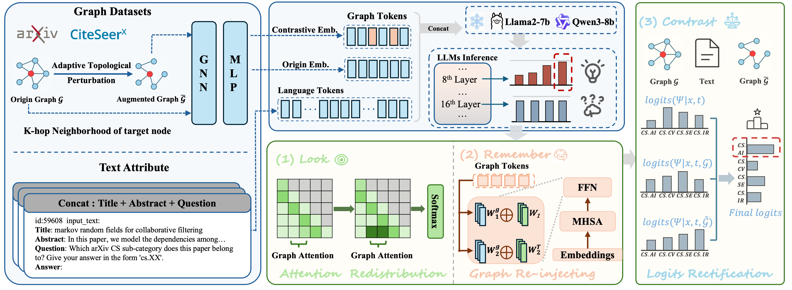

# LoReC: Rethinking Large Language Models for Graph Data Analysis

## :books: Overview
LoReC (Look, Remember, Contrast) is a a novel decoding method that comprehensively enhances LLMs’ understanding of graph data without extra fine-tuning. The contributions are as follows:
- LoReC significantly enhances GraphLLM models' perception and comprehension of graph data.
- LoReC is a plug-and-play solution without extra training or fine-tuning, enabling seamless integration with existing GraphLLM models.

## :briefcase: Dataset & Model Resources

| Resource | Destination Path | Download Link |
| :--- | :--- | :--- |
| **Evaluation Dataset** | `/lorec-gpt/graph_data/eval` | [eval](https://huggingface.co/datasets/Jiabin99/GraphGPT-eval-instruction) |
| **All Graph Data** | `/lorec-gpt/graph_data/All_pyg_graph_data` | [All_pyg_graph_data](https://huggingface.co/datasets/Jiabin99/All_pyg_graph_data) |
| **Stage-1 Data** | `/lorec-gpt/data/stage_1/graph_matching` | [stage_1](https://huggingface.co/datasets/Jiabin99/graph-matching) |
| **Stage-2 Data** | `/lorec-gpt/data/stage_2` | [stage_2](https://huggingface.co/datasets/Jiabin99/Arxiv-PubMed-mix-NC-LP) |
| **Pre-trained GT Checkpoint** | `/lorec-gpt/clip_gt_arxiv`<br>`/lorec-gpt/pretrained_gnn/clip_gt_arxiv` | [clip_gt_arxiv](https://huggingface.co/Jiabin99/Arxiv-PubMed-GraphCLIP-GT) |
| **Vicuna-7b-v1.5-16k** | `/lorec-gpt/vicuna-7b-v1.5-16k` | [Vicuna-7b-v1.5-16k](https://huggingface.co/lmsys/vicuna-7b-v1.5-16k) |

Note that pre-trained gt checkpoint should be written in the config file of vicuna-7b-v1.5-16k:
```
"pretrain_graph_model_path": "path-to-clip_gt_arxiv_pub.pkl"
```

## :pushpin: Usage
### 1. Enviroment
You can install the required enviroment by running the following command:
```
conda create -n lorec-gpt python=3.10
conda activate lorec-gpt

# Install torch with cuda 11.8
pip install torch==2.1.0 torchvision==0.16.0 torchaudio==2.1.0 --index-url https://download.pytorch.org/whl/cu118

# Install pyg and pyg-relevant packages
pip install torch-geometric==2.6.1
pip install pyg_lib torch_scatter torch_sparse torch_cluster torch_spline_conv -f https://data.pyg.org/whl/torch-2.1.0+cu118.html

# Install required libraries
pip install -r requirements.txt
```

### 2. Checkpoint
You can use the uploaded checkpoints or train from scratch.
```
# Train from scratch

# Stage-1
# Fill in the following paths in graphgpt_stage1.sh to conduct stage-1
model_path=./lorec-gpt/vicuna-7b-v1.5-16k
instruct_ds=./lorec-gpt/data/stage_1/graph_matching.json
graph_data_path=./lorec-gpt/graph_data/All_pyg_graph_data/all_graph_data.pt
pretra_gnn=clip_gt_arxiv
output_model=./lorec-gpt/checkpoints/stage_1/arxivpub

# running stage-1
bash ./lorec-gpt/scripts/tune_script/graphgpt_stage1.sh

# Stage-2
# Fill in the following paths in graphgpt_stage2.sh to conduct stage-2
model_path=./lorec-gpt/vicuna-7b-v1.5-16k
instruct_ds=./lorec-gpt/data/stage_2/arxiv_pub_node_st_cot_link_mix.json
graph_data_path=./lorec-gpt/graph_data/All_pyg_graph_data/all_graph_data.pt
pretra_gnn=clip_gt_arxiv
tuned_proj=./lorec-gpt/checkpoints/stage_1/arxivpub/graph_projector.bin
output_model=./lorec-gpt/checkpoints/stage_2/arxivpub_arxiv

# running stage-2
bash ./lorec-gpt/scripts/tune_script/graphgpt_stage2.sh
```
### 3. Evaluation
```
# Fill in the following paths in graphgpt_eval.sh to conduct inference
output_model=path-to-arxivpub
datapath=path-to-arxiv_test_instruct_cot.json
graph_data_path=path-to-all_graph_data.pt
res_path=path-to-eval_output
start_id=0
end_id=20000
log_dir=path-to-logs

# An example is as follows:
output_model=/gemini/code/LoReC/lorec-gpt/checkpoints/stage_2/arxivpub
datapath=/gemini/code/LoReC/lorec-gpt/graph_data/eval/arxiv_test_instruct_cot.json
graph_data_path=/gemini/LoReC/code/lorec-gpt/graph_data/All_pyg_graph_data/all_graph_data.pt
res_path=/gemini/code/LoReC/lorec-gpt/eval_output/arxivpub_arxiv_test
start_id=0
end_id=20000
log_dir=/gemini/code/LoReC/lorec-gpt/logs

# running eval
bash ./lorec-gpt/scripts/eval_script/graphgpt_eval.sh
```
### 4. Calculate metrics
```
# Fill in the following paths in cal_metric_arxiv.py to calculate metrics
folder = 'path-to-eval_output.json files'
graph_data = th.load('path-to-all_graph_data.pt')['arxiv']
df = pd.read_csv('path-to-labelidx2arxivcategeory.csv')

# An example is as follows:
folder = '/gemini/code/LoReC/lorec-gpt/eval_output/arxivpub_arxiv_test/arxivpub_arxiv_test_alpha0.5_beta1.0_drop0.2_edge10'
graph_data = th.load('/gemini/code/LoReC/lorec-gpt/graph_data/All_pyg_graph_data/all_graph_data.pt')['arxiv']
df = pd.read_csv('/gemini/code/LoReC/lorec-gpt/calculate_metric/labelidx2arxivcategeory.csv')

# running calculation
python path-to-cal_metric_arxiv.py
```


